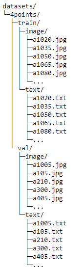

# Mask R-CNN for DIY Graphic Tab 

The codes are based on implementation of [Mask R-CNN](https://arxiv.org/abs/1703.06870) by (https://github.com/matterport/Mask_RCNN) on Python 3, Keras, and TensorFlow. The model generates bounding boxes and segmentation masks for each instance of an object in the image. It's based on Feature Pyramid Network (FPN) and a ResNet101 backbone.

The repository includes:
* Source code of Mask R-CNN built on FPN and ResNet101.
* Instruction and training code for the Paper dataset.
* Pre-trained weights on MS COCO.
* Example of training on your own dataset, with emphasize on how to build and adapt codes to dataset with multiple classes.
* Jupyter notebooks to visualize the detection result.

# Instance Segmentation Samples on Paper Dataset
The model is trained based on pre-trained weights for MS COCO.
### Sample 1

<video width="320" height="240" controls>
  <source src="video.mov" type="assets/v1.mp4">
</video>


### Sample 2


### Sample 3


# Training on Your own Dataset
To train the model you need to modify two classes in ```paper.py```:
1. ```PaperConfig``` This class contains the default configurations. Modify the attributes for your training, most importantly the ```NUM_CLASSES```.
2. ```PaperDataset``` This class inherits from ```utils.Dataset``` which provides capability to train on new dataset without modifying the model. 
3. The data directories for this project are as following. Make sure you include corresponding annotations(.json) in correct directory.



You can take a look or download our dataset from here
[Paper Dataset](https://drive.google.com/drive/folders/14lZV6gsvwlNGUaQfzdeOwQFhpr1AivJ4)

OR you can start training on your own dataset! Training parapeters are mainly included in function ```train``` in ```paper.py```.
```
#Train a new model starting from pre-trained COCO weights
python paper.py train --dataset=/home/.../mask_rcnn/datasets/4points/ --weights=coco

#Train a new model starting from pre-trained ImageNet weights
python paper.py train --dataset=/home/.../mask_rcnn/datasets/4points/ --weights=imagenet

# Continue training the last model you trained. This will find
# the last trained weights in the model directory.
python paper.py train --dataset=/home/.../mask_rcnn/datasets/4points/ --weights=last
```

# Prediction, Visualization, Evaluation
Function```detect_and_warp``` in ```paper.py``` are provided in this project.
To use ```detect_and_warp```, you need to add class_names according to your dataset
```
class_names = ['BG', 'paper']
```
You can make prediction on a specific image, images in a specific directory or even a video, by
```
#Detect and color splash on a image with the last model you trained.
#This will find the last trained weights in the model directory.
python paper.py splash --weights=last --image=/home/...../*.jpg

#Detect and color splash on a video with a specific pre-trained weights of yours.
python sugery.py splash --weights=/home/.../logs/mask_rcnn_paper_0030.h5  --video=..\Mask_RCNN\input\test.mp4
```
NOTE: In order to achieve better results you need to make sure all four corners of the paper are visible through the webcam. For guidance, a sample video demonstrating the process can be found here [Setup Demo](https://drive.google.com/drive/folders/1_eyF5mr4zdSE1XfdjNmkNpOdnUmwKnVr)

* [prediction.ipynb](prediction.ipynb) provides step-by-step prediction and visualization on your own dataset. You can also roughly evaluate the model with metrics of overall accuracy and precision.

# Configurations
Anaconda + Python 3.6.4, TensorFlow 1.7.0, Keras 2.1.5, CUDA 9.0, cudnn 7 and other common packages listed in `requirements.txt`.

# Installation
1. Install dependencies
   ```bash
   pip install -r requirements.txt
   ```
2. Clone this repository
3. Run setup from the repository root directory
    ```bash
    python setup.py install
    ``` 
3. The code will automatically download pretrained COCO weights when you select training with COCO weights. But in case it somehow doesn't work, download pre-trained COCO weights (mask_rcnn_coco.h5) from the [releases page](https://github.com/matterport/Mask_RCNN/releases).
